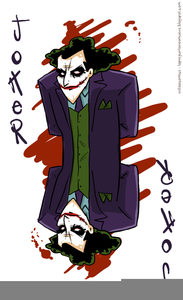

# Project Name
Tic-Tac-Toe

## Table of contents
* [LiveDemoLink](#LiveDemoLink)
* [Description](#Description)
* [Screenshots](#screenshots)
* [Technologies](#technologies)
* [Setup](#Setup)
* [CodeExamples](#CodeExamples)
* [Features](#features)
* [status](#status)
* [WishList](#WishList)
* [Contact](#contact)

## LiveDemoLink
[LiveDemoLink](https://karthikeyansekar-sydney.github.io/Tic-Tac-Toe/)

## Description
This is a simple game of tic tac toe that I have created with my javascript/jquery skills. Here I have created a tic-tac-toe game where two players can play against each other with a more appealing UserInterface and catchy CSS effects.

## Screenshots


## Technologies
[jQuery JavaScript Library v3.5.1 ](https://jquery.com/)

## Setup
<h5>To Play the game</h5>
* git fork(to get the code from my Repository to your remote repository)
* git clone "URL"(to get the code from your repository to the Local Repository)

<h5>To Update any codes to the existing Project do the steps as follows:</h5>
* git add -A
* git commit -m "your message"
* git pull upstream master
* git push origin master
* Pull request to merge the changes made


## CodeExamples
```js code

const resetGame = () => {
  squares.forEach(square => {
  square.classList.remove(x_class);
  square.classList.remove(circle_class);
  square.classList.add('playCards');
  currentPlayer = 'playerX'
  })
  winningMessageElement.classList.remove('show');
};

restartButton.addEventListener('click', resetGame);
restartBtn.addEventListener('click', resetGame);

const endGame = (draw, currentPlayer) => {
  if(draw){
winningMessageTextElement.innerText = "Draw";
 } else {
   winningMessageTextElement.innerText = `${currentPlayer}  Wins`;
 }
 winningMessageElement.classList.add('show');
};

const isDraw = () => {
  return squareArray.every(cell => {
    return cell.classList.contains(x_class) ||
  cell.classList.contains(circle_class)
  })
};

const winningCombinations = [
  [0, 1, 2],
  [3, 4, 5],
  [6, 7, 8],
  [0, 3, 6],
  [1, 4, 7],
  [2, 5, 8],
  [0, 4, 8],
  [2, 4, 6]
];

const checkWin = (currentClass) =>{
  /* array.some returns true if any of the values in the loop is true */
  return winningCombinations.some(combination => {
    /* array.every method To check if the every element have same class */
    return combination.every(index => {
      return squares[index].classList.contains(currentClass);
    })
  })
};
```
## Features
List of features ready:
* Two Player Game Option
* Interactive User Interface
* Improved look and feel

To-do list:
* Option to play against computer(AI)
* Level of the game say easy, medium, Hard

## Status
Project is: _in progress_

## WishList
* Option to play against computer(AI)
* Level of the game say easy, medium, Hard

## Contact
Created by [@karthik](karthikeyansep27@gmail.com) - feel free to contact me!
